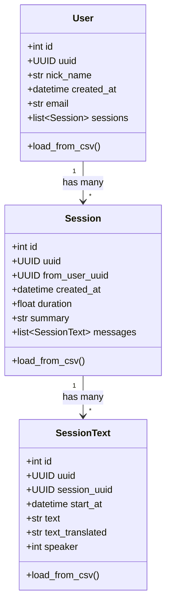

# Pydantic Data Models for Data Analysis

## Data Model Architecture




## File Structure

```javascript
models/
  __init__.py          # Export all models
  session_text.py      # SessionText model
  session.py           # Session model  
  user.py              # User model
  loader.py            # CSV loading utilities
```


## Implementation Details

### 1. SessionText Model (`models/session_text.py`)

- Fields from `session_text.csv`: id, uuid, session_uuid, start_at, text, text_translated, speaker, is_input, type
- Class method `load_from_csv()` to parse CSV file

### 2. Session Model (`models/session.py`)

- Fields from `session.csv`: id, uuid, from_user_uuid, session_type, session_status, created_at, duration, summary, etc.
- A `messages: list[SessionText]` field to hold conversation history
- Class method `load_from_csv()` to parse CSV file

### 3. User Model (`models/user.py`)

- Fields from `user.csv`: id, uuid, nick_name, created_at, email, credits, etc.
- A `sessions: list[Session]` field to hold user's sessions
- Class method `load_from_csv()` to parse CSV file

### 4. Data Loader (`models/loader.py`)

- `DataLoader` class to load all CSVs and link the relationships
- Method to populate User.sessions and Session.messages

## Dependencies